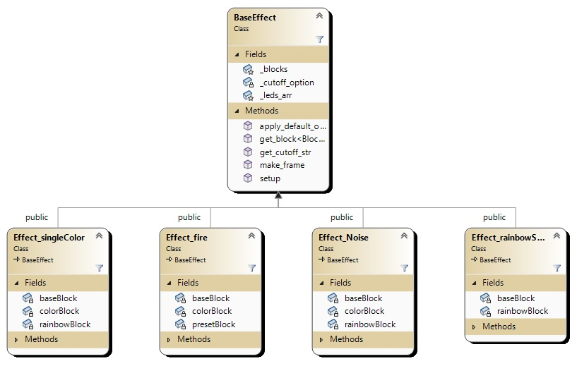
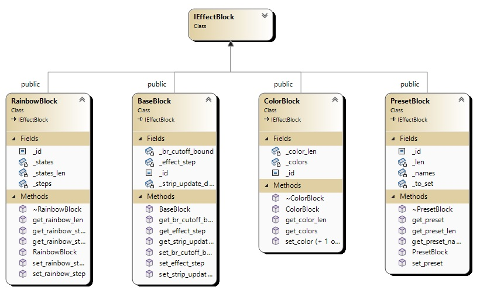
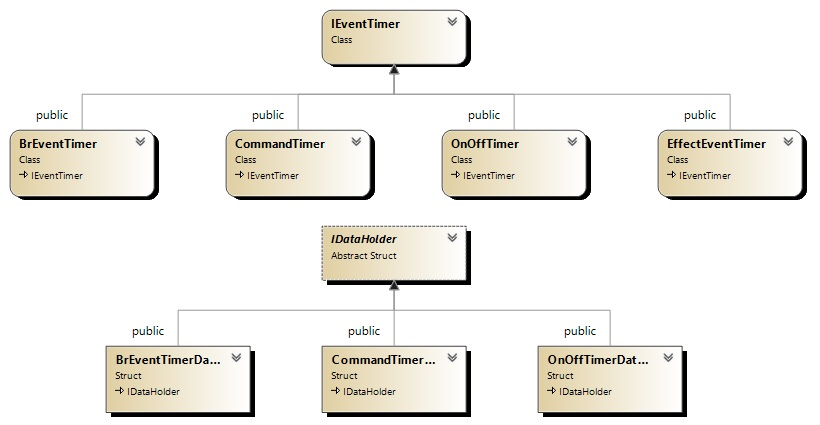
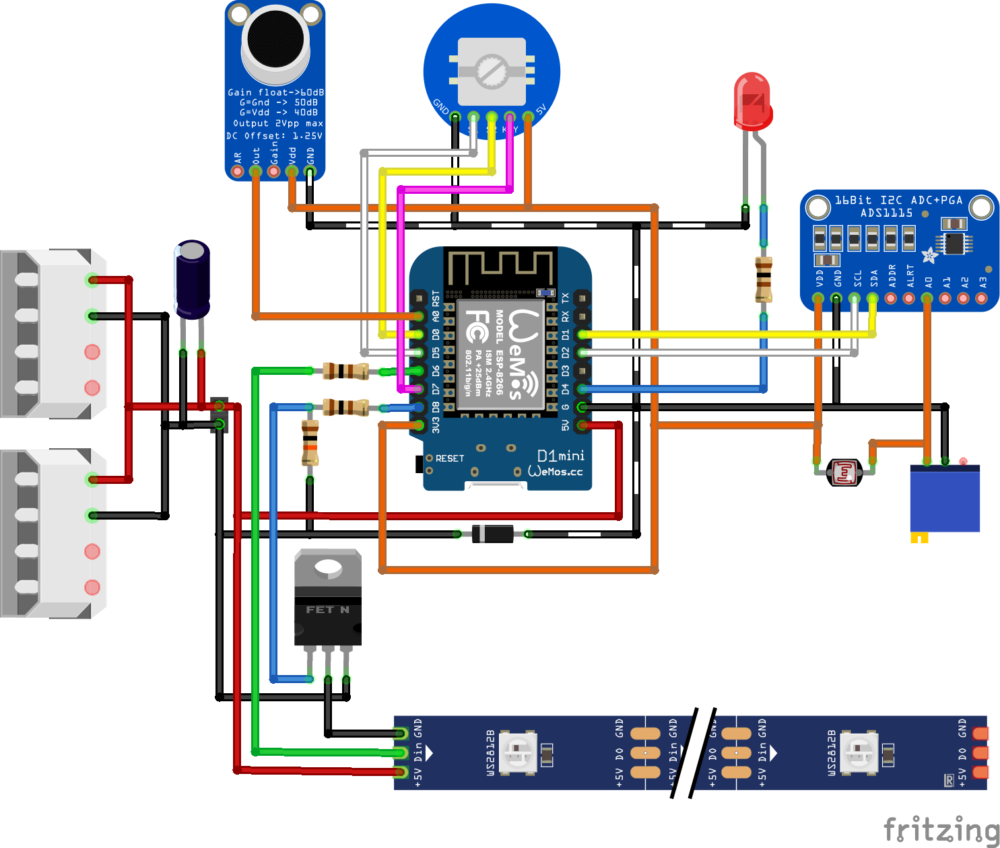
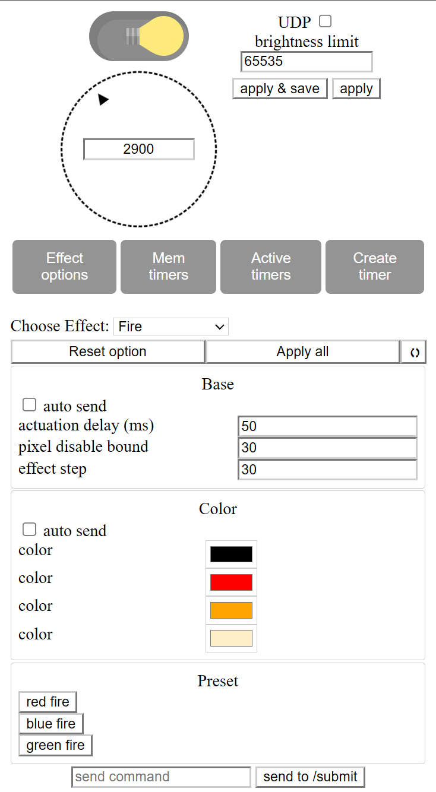
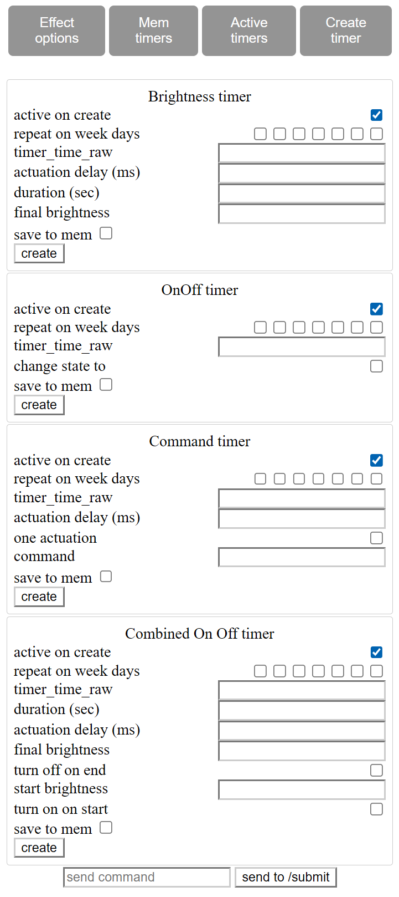
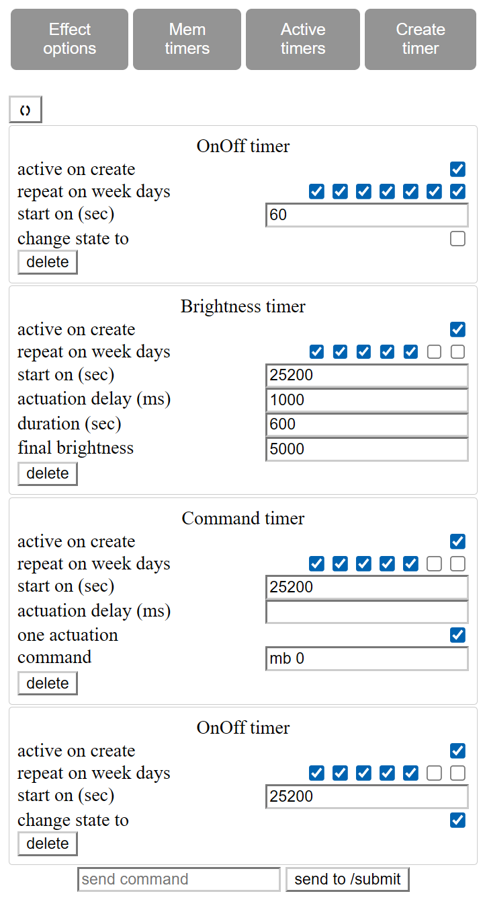

# Modular ARGB Lighting Control System Based on ESP

This project implements a smart addressable lighting controller powered by **ESP8266**, designed with a focus on **extensibility, modularity, and resilience**. The core framework allows developers to focus on creating specific lighting behaviors without dealing with low-level implementation details or platform limitations.

The system combines an **object-oriented architecture**, **design patterns**, and low-level optimizations to provide a flexible foundation for building customizable lighting logic.

---

## ⚙️ Architecture

The project is structured as a modular framework where lighting modes are decoupled from the core and communicate via standard interfaces. This allows for easy scalability and extension without modifying the system internals. The core includes:

- A manager for effect modes and configuration blocks
- Declarative configuration interface
- Timer subsystem
- REST API and UDP communication
- Non-volatile memory management
- Real-time generation of the web-based user interface

---

## 🧱 Configuration Blocks and Web Interface

Each effect mode is defined through a set of **configuration blocks**. These blocks:

- Are described declaratively within the mode configuration
- Are automatically rendered in the web interface using a template-based HTML system
- Can be reused across different modes

The HTML template engine supports constructs like `insert-list`, `prop-tag`, and `id`, with nesting and parameterization to build complex interfaces without writing custom frontend code. Rendering is handled by a general-purpose function that resolves relationships between templates.

---

## ⏱ Timer Subsystem

A flexible timer system is implemented with persistent storage in EEPROM:

- **One-shot timers**: execute a command after a defined delay
- **Recurring timers**: trigger actions based on day-of-week schedules and exact time
- Timers are retained in non-volatile memory and restored on reboot with full timing accuracy

---

## 🌐 User Interaction

Interaction with the system is provided through:

- **REST API** — for controlling modes, parameters, and timers. See [api.txt](api.txt) for the full command set
- **Web interface**, dynamically generated from the current mode configuration and powered by REST
- **UDP commands** — allows real-time color updates from external clients (e.g., desktop applications)
- **Hardware control** — via onboard rotary encoder

---

## 🧠 Technical Highlights

- **EEPROM memory manager**: efficient allocation and dynamic reuse of non-volatile memory
- **Advanced brightness control algorithm**: gamma correction, per-pixel brightness adjustment, color fidelity preservation, and fixed-point division optimization
- **Reboot resilience**: full restoration of configuration, active mode, and timers after restart
- **Strict separation of mode logic from system infrastructure and rendering logic**

---

## 🔌 Hardware Overview

- Controller: ESP8266
- LEDs: WS2812 addressable LED strip
- Input: rotary encoder

---

## 💻 Desktop Client

The system integrates with an external desktop application that streams real-time color data to the lamp over **UDP**, enabling instant visual response and screen-synchronized lighting.  
[LampDesktop — GitHub Repository](https://github.com/x-urt-x/LampDesktop)

---

## 🚀 Roadmap

The system is actively evolving, with planned developments including:

- Migration to **ESP32-S3** using dual-core architecture and multithreaded execution
- Optimization of LED output via **hardware acceleration (RMT)** or equivalent methods
- Expansion of the effects system and development of a **Visual Studio Code extension** for simplified effect scripting
- Support for external input sources: **microphone**, **IR receivers**, **radio modules**, **Bluetooth**
- Implementation of **adaptive brightness** based on ambient light sensors

The platform is designed for long-term extensibility without requiring changes to the core.

---

## 🖼 Web Interface Example

The web interface is generated dynamically from the active mode configuration and available control blocks. Below are sample UI screenshots:

| Main Interface | Timer Creation | Timer Memory View |
|-------------------|----------------|----------------|
|  |  |  |